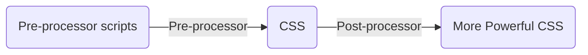

## CSS
- Cascading Stylesheets, 階層樣式表
- 風格頁面語言（style sheet language）
- 選擇器（Selector）
- 宣告（Declaration）= 屬性 (Properties) + 屬性值 (Property value)

::right::


---
layout: two-cols
---

### Selector
```html

```
- 元素選擇器
  ```css
  img {
    width: 100px;
    height: 100px;
  }
  ```
- ID 選擇器
  ```css
  #root {
    border-radius: 50px;
  }
  ```
- Class 選擇器
  ```css
  .class1 {
    border: 10px solid blue;
  }
  ```

::right::


- 屬性選擇器
  ```css
  [src] {
    padding: 10px;
  }
  ```
- 虛擬 class 選擇器（Pseudo-class selector）
  ```css
  img:hover {
    cursor: pointer;
  }
  ```

> [Further Reading](https://developer.mozilla.org/en-US/docs/Web/CSS/CSS_Selectors)

---

### Position

- relative
- absolute
  - removed from the normal document flow
  - no space is created for the element in the page layout
  - positioned relative to its **closest positioned ancestor**
- fixed
  - removed from the normal document flow
  - no space is created for the element in the page layout
  - positioned relative to **the initial containing block** established by the viewport
- sticky
  - offset relative to its nearest scrolling ancestor and containing block (nearest block-level ancestor)
---
layout: two-cols
---

### Display
- block: generating line breaks both before and after the element when in the normal flow.
- inline-block
- flex
  - [CSS Flexible Box Layout](https://developer.mozilla.org/en-US/docs/Web/CSS/CSS_Flexible_Box_Layout)
  
<Flex className="w-full h-1/3" />

::right::

- grid
  - [Grid Layout](https://developer.mozilla.org/en-US/docs/Web/CSS/CSS_Grid_Layout/Basic_Concepts_of_Grid_Layout)


---
layout: two-cols
---

### Colors
- background
  ```css
  background: red;
  background: url('/ha.png');
  background-image: linear-gradient(#e66465, #9198e5);
  ```

  <div class='flex gap-4'>
  <div class='w-25 h-25 bg-red-500'></div>
  <div class='w-25 h-25' style='background: url(/ha.png)'></div>
  <div class='w-25 h-25 bg-gradient-to-r from-[#e66465] to-[#9198e5]'></div>
  </div>
- text
  ```css
  color: red;
  ```
  <h3 class='text-red-500'>Green Text</h3>

::right::

- border
  ```css
  border: 10px solid blue;
  ```
  <div class='w-25 h-25 border-10 border-blue-500'></div>
---

### Text

- font-family
- font-size
- font-weight

---
layout: two-cols
---

### Sizing
- width
- height
- padding
- margin
- box-sizing
  - border-box
  - content-box

```css
width: 100px;
height: 100px;
padding: 8px;
margin: 4px;
box-sizing: border-box | content-box;
```

::right::


---

## Pre or Post-processor



<div class='flex'>

<div class='flex-1'>

- Pre-processor
  - [](https://sass-lang.com/), [](https://stylus-lang.com/), [](https://lesscss.org/), [](https://postcss.org/)
  - Take a language that compiles to CSS

<div class="flex-center gap-10">

```scss
$font-stack: Helvetica, sans-serif;
$primary-color: #333;

body {
  font: 100% $font-stack;
  color: $primary-color;
}
```

→

```css
body {
  font: 100% Helvetica, sans-serif;
  color: #333;
}
```

</div>

</div>

<div class='flex-1'>

- Post-processor
  - [](https://postcss.org/)
  - Align and refurbish CSS to have the best possible outcome for today’s browsers.

> [Deconfusing Pre- and Post-processing](https://medium.com/@ddprrt/deconfusing-pre-and-post-processing-d68e3bd078a3)

</div>

</div>