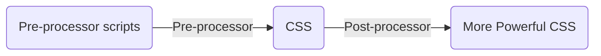

---
# try also 'default' to start simple
theme: seriph
# random image from a curated Unsplash collection by Anthony
# like them? see https://unsplash.com/collections/94734566/slidev
background: /cover.png
# apply any windi css classes to the current slide
class: 'text-center'
# https://sli.dev/custom/highlighters.html
highlighter: shiki
# show line numbers in code blocks
lineNumbers: false
# some information about the slides, markdown enabled
info: |
  ## Tailwind CSS
  A utility-first CSS framework.

  Learn more at [Tailwind CSS](https://tailwindcss.com/)
# persist drawings in exports and build
drawings:
  persist: false
download: true
---

# Tailwind CSS

A utility-first CSS framework

<div class="pt-12">
  <span @click="$slidev.nav.next" class="px-2 py-1 rounded cursor-pointer" hover="bg-white bg-opacity-10">
    Press Space for next page <carbon:arrow-right class="inline"/>
  </span>
</div>

<div class="abs-br m-6 flex gap-2">
  <button @click="$slidev.nav.openInEditor()" title="Open in Editor" class="text-xl icon-btn opacity-50 !border-none !hover:text-white">
    <carbon:edit />
  </button>
  <a href="https://github.com/slidevjs/slidev" target="_blank" alt="GitHub"
    class="text-xl icon-btn opacity-50 !border-none !hover:text-white">
    <carbon-logo-github />
  </a>
</div>

<!--
The last comment block of each slide will be treated as slide notes. It will be visible and editable in Presenter Mode along with the slide. [Read more in the docs](https://sli.dev/guide/syntax.html#notes)
-->

---

## [Utility First](https://tailwindcss.com/docs/utility-first)

Building complex components from a constrained set of primitive utilities.

### Props:
- You aren’t wasting energy inventing class names.
- Your CSS stops growing
- Making changes feels safer.

### Cons:
- Long classNames
- Lack of Components
- You need a strong understanding of CSS

---
layout: two-cols
---

<div class="full flex-center">
  <div class="grid grid-cols-2 gap-y-5 gap-x-10">
    <span>Tailwind CSS</span>
    <span>Pure CSS</span>
    <WalletButton />
    <button class="wallet-btn">
      ExFcD7...B7fb
      
    </button>
  </div>
</div>

::right::

```html
<button
  class="
    py-2 px-3 text-sm rounded
    flex items-center gap-1 
    bg-[#EEEFEE] text-[#414844] 
    hover:bg-[#6A766E] hover:text-[#FFFFFF] 
    dark:bg-[#404448] dark:text-[#FFFFFF] dark:hover:bg-[#6B6F73]
  "
>
  ExFcD7...B7fb
  
</button>
```

---
layout: two-cols
---

<div class="full flex-center">
  <div class="grid grid-cols-2 gap-y-5 gap-x-10">
    <span>Tailwind CSS</span>
    <span>Pure CSS</span>
    <WalletButton />
    <button class="wallet-btn">
      ExFcD7...B7fb
      
    </button>
  </div>
</div>

::right::

```html
<button class="wallet-btn">ExFcD7...B7fb</button>
```
```css
.wallet-btn {
  padding: 0.5rem 0.75rem;
  border-radius: 0.25rem;
  font-size: 0.875rem;
  line-height: 1.25rem;
  display: flex;
  align-items: center;
  grid-gap: 0.25rem;
  gap: 0.25rem;
  background-color: #eeefee;
  color: #414844;
}
.wallet-btn:hover {
  background-color: #6a766e;
  color: #ffffff;
}
.dark .wallet-btn {
  background-color: #404448;
  color: #ffffff;
}
.dark .wallet-btn:hover {
  background-color: #6b6f73;
}
```

---
src: ./slides/base.md
---

---
src: ./slides/display.md
---

---
src: ./slides/color.md
---

---
src: ./slides/hover.md
---

---

## Pre or Post-processor



- Pre-processor
  - [](https://sass-lang.com/), [](https://stylus-lang.com/), [](https://lesscss.org/), [](https://postcss.org/)
  - Take a language that compiles to CSS

<div class="flex-center gap-10">

```scss
$font-stack: Helvetica, sans-serif;
$primary-color: #333;

body {
  font: 100% $font-stack;
  color: $primary-color;
}
```

→

```css
body {
  font: 100% Helvetica, sans-serif;
  color: #333;
}
```

</div>

- Post-processor
  - [](https://postcss.org/)
  - Align and refurbish CSS to have the best possible outcome for today’s browsers.

> [Deconfusing Pre- and Post-processing](https://medium.com/@ddprrt/deconfusing-pre-and-post-processing-d68e3bd078a3)

---
layout: iframe-right
url: https://tailwindcss.com/docs/reusing-styles#extracting-components-and-partials
---

## [Reusing Styles](https://tailwindcss.com/docs/reusing-styles)

- Extracting components and partials
  - css component or js component
- Extracting classes with @apply

<div class=" items-center">

```html
<button
  class="
    py-2 px-3 text-sm rounded
    flex items-center gap-1 
    bg-[#EEEFEE] text-[#414844] 
```

→

```css
.btn {
  @apply py-2 px-3 text-sm rounded flex items-center gap-1 bg-[#EEEFEE] text-[#414844];
}
```

</div>

---
src: ./slides/custom-styles.md
---

---
layout: iframe-right
url: https://play.tailwindcss.com/KZwO9gU4RW?layout=preview
---

## Why is my CSS class not working?

- Css always run from top to bottom it dosen't matter what is the order you have given to your classes.
- Css looks if defined property is important or not

### How tailwindcss handles css classes?

- @layer
  - base
  - components
  - utilities

---

## [Safelist](https://tailwindcss.com/docs/content-configuration#safelisting-classes)

`tailwind.config.js`

```js
module.exports = {
  ...,
  safelist: [
    'text-2xl',
    'text-3xl',
    {
      pattern: /bg-(red|green|blue)-(100|200|300)/,
      variants: ['lg', 'hover', 'focus', 'lg:hover'],
    },
  ]
}
```

- Don't construct class names dynamically

```html
<div class="text-{{ error ? 'red' : 'green' }}-600"></div>
```

- Always use complete class names

```html
<div class="{{ error ? 'text-red-600' : 'text-green-600' }}"></div>
```

---
src: ./slides/plugins.md
---


